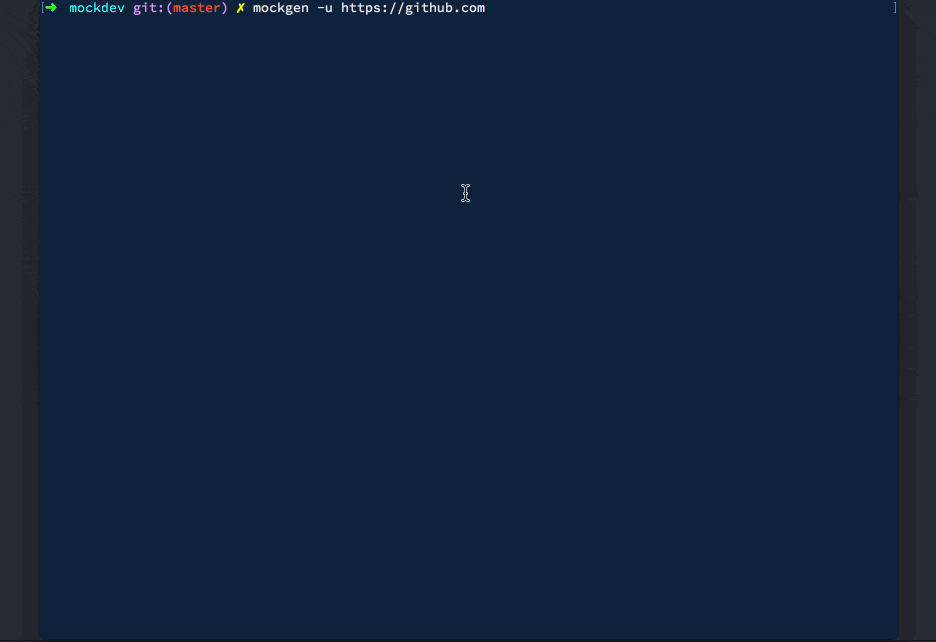

title: Device Mockup Generator
date: April, 2018
description: Generating device mockups with Chrome Headless.
tags: Javascript, Node, Puppeteer
order: 20

I had been wanting to release an NPM package for a long time but I have always held back myself as there are packages(sometimes several tens of them to do the same thing) for pretty much everythig.

One day, I noticed the designers at my workplace generating device mockups. I started looking if there was any package that could make this simpler but couldn't find anything. Wow! Finally a chance :D

I immediately started working on it with Puppeteer, a Node package that provides easy to use APIs to work with Chrome Headless. My idea was to use the device emulator to emulate screen size and resolution and take screenshots using Puppeteer's API.

After a few hours of looking around for free-to-use device mockups, I settled on [Facebook Devices](https://facebook.design/devices). It had multiple devices including desktops, laptops, tablets and even smartwatches. The only problem was it prohibits people from repackaging or redistributing it.

I decided on a somewhat unconventional requirement of asking the users to have it downloaded in their machines already and passing that location as an arg to the generator's CLI. The quality that Facebook Devices provides is extremely good and a worthwhile compromise to have this weird requirement.

It took me about two and a half hours to code this and I finally [released](https://www.npmjs.com/package/@astronomersiva/mockgen) my first NPM package!

As of now, I have only configured it for a few devices that me and my friends use and will add more if requirements arise. Feel free to [file an isse](https://github.com/astronomersiva/mockgen/issues/new), [fork it](https://github.com/astronomersiva/mockgen#fork-destination-box) or submit a PR!

